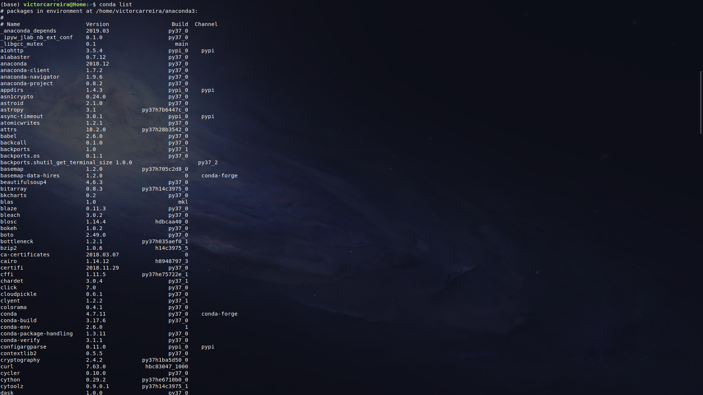

# Inverse_problems

## Público Alvo:
 Esse curso destina-se inicialmente a reunião das minhas notas de estudos pessoais sobre problemas inversos.

**Responsável**: [Carreira,V.R.](http://lattes.cnpq.br/9663791782095105)

**Aviso Legal:** O material disponibilizado neste repositório está em constante desenvolvimento. 

## Informações importantes:

Esta página está hospedada em um repositório no GitHub. Um repositório é uma forma muito útil, onde muita gente ao redor do mundo vem utilizado pormeio do Git e do GitHub, para fazer colaborações científicas, divulgação, organizar e distribuir material desenvolvido em disciplinas, palestras, seminários, etc. AO LONGO DESTE CURSO, NÃO SERÁ COBRADO O CONHECIMENTO SOBRE Git OU GitHub. Mas, como conhecimento nunca é demais, abaixo segue uma lista de links úteis sobre Git e GitHub:

* [Tudo que você queria saber sobre Git e GitHub, mas tinha vergonha de perguntar](http://tableless.com.br/tudo-que-voce-queria-saber-sobre-git-e-github-mas-tinha-vergonha-de-perguntar/)

* [Software Carpentry - Version Control with Git](http://swcarpentry.github.io/git-novice/)

* [Good Resources for Learning Git and GitHub](https://help.github.com/articles/good-resources-for-learning-git-and-github/)

**Agradecimento Especial:** [Dr. Vanderlei C. Oliveira Jr.](http://www.pinga-lab.org/people/oliveira-jr.html)

## Material necessário para o curso:

**fonte:** [GIPHY](https://media.giphy.com/media/tvGOBZKNEX0ac/giphy.gif)

No desenvolvimento deste curso eu pensei em torná-lo o mais abrangente e com o menor custo possível, pois esta é a realidade da maioria das universidades e escolas brasileiras. Mas caso você estude em uma universidade ou trabalhe em uma empresa com muitos recursos saiba que esse curso também serve para você! 

Em termos de Hardware você vai precisar nada mais do que um Intel Core I3 ou um AMD Athlon 200GE com 4gb Ddr3 ou superior. 

Em termos de software vamos precisar do python**3.X** (para alegria Pythônica e tristeza Fortrânica. Caso você tenha viajado neste parêntese, simplesmente ignore-o.) instalado em seus sistema, seja ele windows, linux ou macOS. E para tornar o curso acessível ao maior número de pessoas que tenham máquinas com especificações de hardware mais simples iremos utilizar o editor de textos VIM em associação com um terminal de seu gosto. Eu recomento o Deepin Terminal ou o Terminator.   

## O VIM:

O [VIM](https://www.vim.org) é um editor de texto sem interface gráfica que pode ser utilizado a partir de um terminal. Ele serve para edição de programas e textos em TeX, sendo muito interessante e altamente recomendável para programadores que possuam máquinas com hardware menos favorecidos. Quando você salva um arquivo usando o VIM são salvo ao todo 4 arquivos, dentre os quais existe um com extensão *.swp . Este arquivo de "swap" ou de troca salva a última versão do seu programa mesmo que você não tenha feito isso manualmente. Você poderá sempre recuperar um ponto do seu código "perdido" por alguma eventualidade. Além disso o VIM possibilita diversos tipos de highlighting e formatações. Todos esses recursos na sua mão com apenas alguns quilobytes de memória em uso.  

**fonte:** [GIPHY](https://miro.medium.com/proxy/0*UphlBownJE5j7lI8.gif) 

## O Deepin Terminal e o Terminator:
Esses dois programas, o [Deepin Terminal](https://www.deepin.org/en/original/deepin-terminal/) e o [Terminator](https://terminator-gtk3.readthedocs.io/en/latest/gettingstarted.html) são ambos editores de texto que possuem a capacidade de dividir a tela da sua área de trabalho. Esse recurso é de suma importância para compilar seu código, contudo não é primordial.  

**IMPORTANTE**: usuários de windows já podem usar o "windows terminal" a partir da versão windows 10 ou superior.

## Instalação do Python e de suas dependências

Para instalar o Python Anaconda, sugiro
seguir as [instruções do Software Carpentry](https://carpentries.github.io/workshop-template/#python).
Outra opção é acessar diretamente o [site o Python Anaconda](https://www.anaconda.com/distribution/#download-section).

**IMPORTANTE**: Uso o Python 3.8!

Para checar se a instalação deu certo, abra uma janela do prompt de comando,
caso você esteja no Windows, ou um terminal, se estiver no Linux. Em seguida,
Digite o comando: `conda list`. Este comando mostrará uma lista de *coisas* que
foram instaladas pelo Anaconda. Deve aparecer algo do tipo:

 

 A lista de pacotes continua em ordem alfabética. Note que as informações
 associadas ao pacote `anaconda` são `2020.03` e `py38_0`.

## Bibliografia recomendada:

* Press, W. H., Teukolsky, S. A, Vetterling, W. T. e Flannery,
B. P. Numerical recipes in C: The art of scientific computing, 3rd edition, 
Cambridge University Press, 2007, ISBN 978-0-511-33555-6.

* Papers: 
  

## Sites importantes!

 * [3Blue1Brown](https://www.youtube.com/channel/UCYO_jab_esuFRV4b17AJtAw)

 * [Software Carpentry](http://software-carpentry.org/index.html)

 * [Pythonic Perambulations](https://jakevdp.github.io/)

 * [A gallery of interesting Jupyter Notebooks](https://github.com/jupyter/jupyter/wiki/A-gallery-of-interesting-Jupyter-Notebooks)

 * [Notebook Gallery - Links to the best IPython and Jupyter Notebooks](http://nb.bianp.net/sort/views/)
 
 * [Animation in python](https://towardsdatascience.com/animations-with-matplotlib-d96375c5442c)

 * [matplotlib - 2D and 3D plotting in Python](http://nbviewer.jupyter.org/github/jrjohansson/scientific-python-lectures/blob/master/Lecture-4-Matplotlib.ipynb)

 * [WolframMathWorld](https://mathworld.wolfram.com/InverseProblem.html)

 * [Geophysical Tutorials](https://library.seg.org/doi/pdf/10.1190/tle35020190.1)

 * [Khanademy](https://pt.khanacademy.org)

 * [Pandas](http://pandas.pydata.org/)

 * [SciPy](https://scipy.org/about.html)

 * [Fatiando a Terra](http://www.fatiando.org/index.html)
